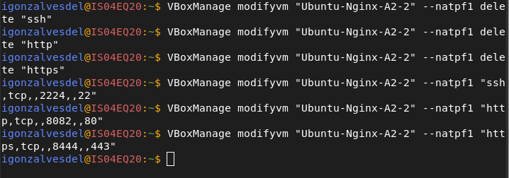
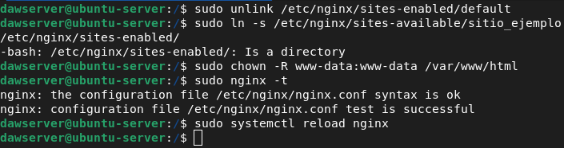
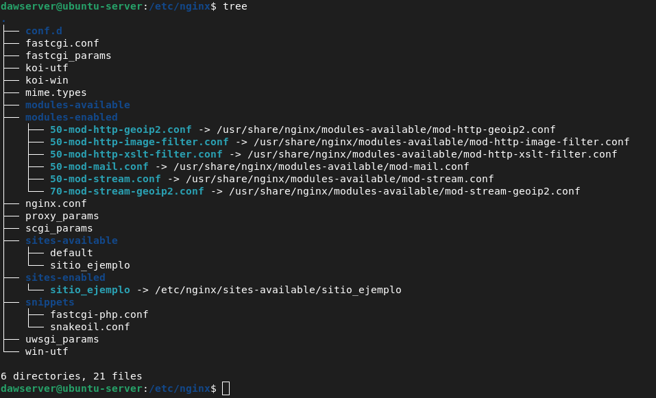
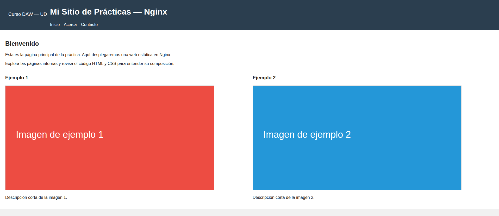
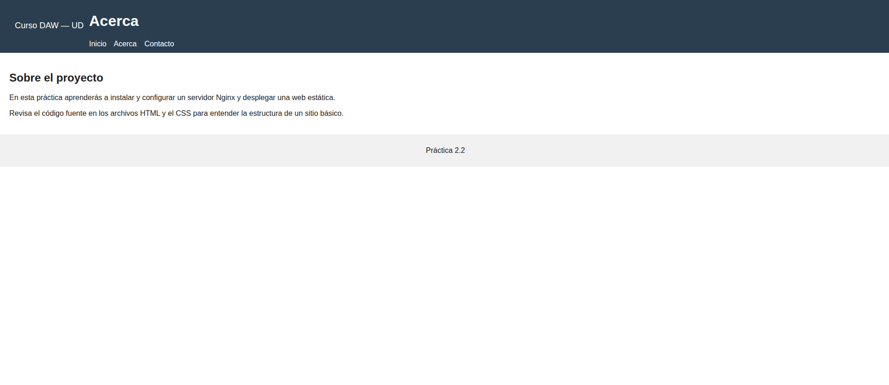
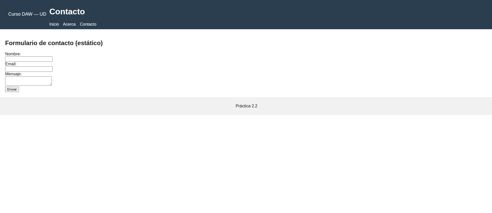

# 🧩 Actividad 2.2 — Instalación y despliegue con Nginx

## 🎯 Objetivo
El objetivo de esta práctica es **instalar y configurar Nginx** en una máquina virtual Ubuntu 22.04 y **desplegar un sitio web estático** con navegación entre páginas, imágenes y estilos.

---

## 🧰 Requisitos previos

- **VM Ubuntu 22.04 base** (OVA proporcionada en el repositorio del curso)
- **VirtualBox** instalado en el host
- **Conexión entre host y guest** (modo Host-Only o NAT + Port Forward)
- **Permisos sudo** en la VM

---

## ⚙️ Pasos de instalación y configuración

### 1. Creación de la máquina virtual

Crear la VM como clon enlazado de la base:

```bash
VBoxManage clonevm "Ubuntu-Server-Base" --name "Ubuntu-Nginx-A2-2" --snapshot "After-Config-Proxy" --options link --register
```

Configurar red (NAT + redirección de puertos):

```bash
VBoxManage modifyvm "Ubuntu-Nginx-A2-2" --natpf1 "ssh,tcp,,2224,,22"
VBoxManage modifyvm "Ubuntu-Nginx-A2-2" --natpf1 "http,tcp,,8082,,80"
VBoxManage modifyvm "Ubuntu-Nginx-A2-2" --natpf1 "https,tcp,,8444,,443"
```

Acceso SSH desde el host:

```bash
ssh -p 2224 dawserver@localhost
```

---

### 2. Preparación del entorno

Actualizar paquetes e instalar Nginx:

```bash
sudo apt update && sudo apt upgrade -y
sudo apt install -y nginx
```

Configurar el firewall para permitir tráfico HTTP/HTTPS:

```bash
sudo ufw allow 'Nginx Full'
sudo ufw enable
sudo ufw status
```

---

### 3. Comprobación básica

Verificar el servicio:

```bash
sudo systemctl status nginx
```

Desde el navegador del host, acceder a:

👉 **http://localhost:8082**

Debería mostrarse la página por defecto de Nginx.

---

### 4. Desplegar el sitio web de ejemplo

Copiar los archivos del sitio al directorio raíz del proyecto:

```bash
sudo mkdir -p /var/www/sitio_ejemplo
sudo cp -r ~/sitio_ejemplo/* /var/www/sitio_ejemplo/
```

---

### 5. Configurar un bloque de servidor

Crear el archivo `/etc/nginx/sites-available/sitio_ejemplo`:

```nginx
server {
   listen 80;
   server_name _;

   root /var/www/sitio_ejemplo;
   index index.html;

   location / {
      try_files $uri $uri/ =404;
   }
}
```

Activar la configuración:

```bash
sudo unlink /etc/nginx/sites-enabled/default
sudo ln -s /etc/nginx/sites-available/sitio_ejemplo /etc/nginx/sites-enabled/
sudo chown -R www-data:www-data /var/www/sitio_ejemplo
sudo nginx -t
sudo systemctl reload nginx
```

---

### 6. Verificación

Desde el host:

👉 **http://localhost:8082**

Debería visualizarse tu sitio con navegación, imágenes y estilos correctamente cargados.

---

## 🧩 Estructura de directorios

```bash
/var/www/sitio_ejemplo/
├── index.html
├── about.html
├── css/
│   └── style.css
├── img/
│   ├── logo.png
│   └── banner.jpg
└── js/
    └── script.js
```

---


## 🖼️ Capturas de pantalla sugeridas

Incluye en el repositorio las siguientes imágenes:

## Configuración:


## Comprobaciones:


## Estructura de archivos del sitio:

  
## Página web funcionando en el navegador:




---

## 🧠 Problemas encontrados

### 🧾 1. Se muestra “Welcome to nginx!”
**Causa:** El sitio por defecto sigue activo.  
**Solución:**
```bash
sudo unlink /etc/nginx/sites-enabled/default
sudo systemctl reload nginx
```

---

### 🔍 2. Error 404 en páginas internas
**Causa:** Rutas incorrectas o fallo en `try_files`.  
**Solución:**
Verificar rutas y configuración del bloque `server`.

---

## 📚 Autor
**Nombre del estudiante:** *Ivan Gonzalves del Valle*  
**Asignatura:** Despliegue de Aplicaciones Web  
**Actividad:** 2.2 — Instalación y despliegue con Nginx  
**Fecha:** *06/11/2025*

---

## 🔗 Enlace al repositorio
[https://github.com/RispiGonzalves/despr2_2_nginx](https://github.com/RispiGonzalves/despr2_2_nginx)
